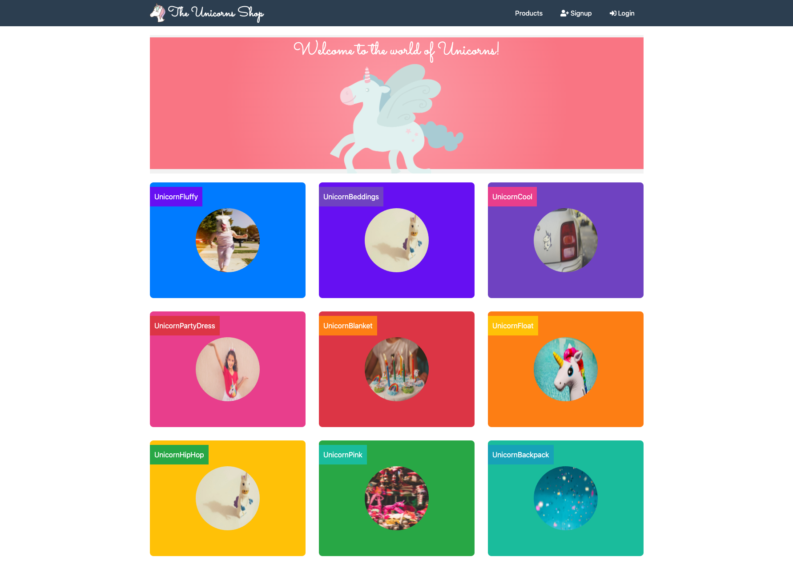

# The Unicorn Store Frontend

This directory contains source code for the frontend of the unicorn shop application.

## Build

Contents in this folder are for internal use. Workshop participants can ignore it.

## Src

The src folder contains the frontend source code, whose major components are the user interface and the respective controllers handling services offered in frontend by generating requests and communicating with the server.

Inside ./src/config.json are important frontend configurations that we will repetitively visit and modify during the workshop as we proceed in the modernization process.